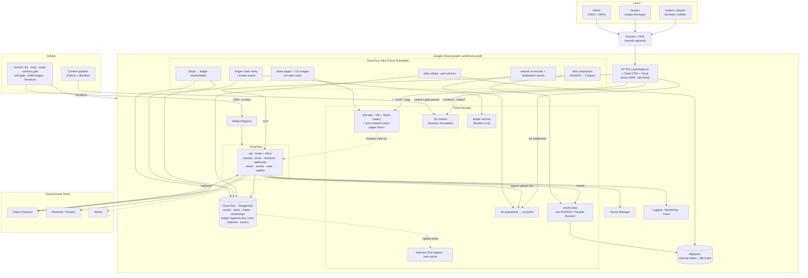
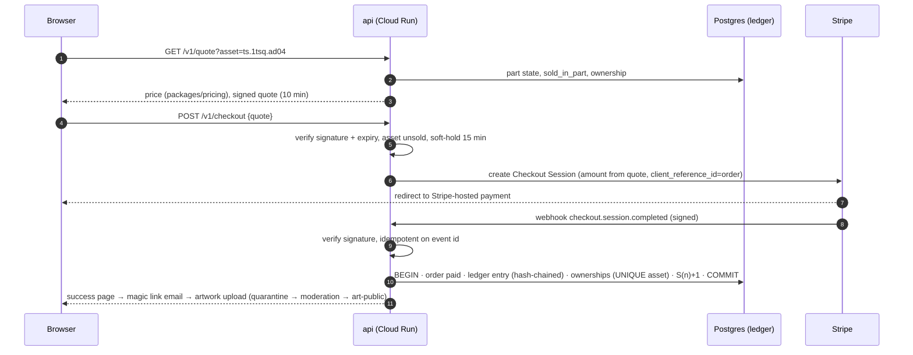

# World Twin: architecture, folder structure and engineering plan

Written 2026-10-04, from a staff-engineer view. **This is the product scope going forward:**
- a **multi-city digital twin platform**, starting with NYC (Times Square + the harbour);
- more cities only if this works (`future_districts.md`);
- money comes **only from permanent ownership of limited assets** (banners, screens, buildings; `pricing_and_revenue.md`);
- **every analytics event is kept**, because the data may become its own business later;
- **cloud: GCP first, easy to move to AWS or Azure.**

Go-live is **next week**, so the plan has two speeds:
- a **launch-minimal** slice (§9, M0) that is safe to take money with and starts collecting data on day 1;
- the **target architecture** we migrate toward in small steps, without a big-bang rewrite.

---

## 1. Principles (what every decision is checked against)

1. **Cities are data, not code.**
   - Adding London must mean adding a content package, not forking the engine.
   - No NYC constants in engine code. Today there are some: the Midtown rect, the Intrepid deck, `SHORE_X`. These move into the city package (§5).
2. **Asset IDs are forever.**
   - A sold screen's ID (`ts.1tsq.ad04`) is part of a permanent contract with its owner.
   - The pipeline may rebuild meshes, but **it must never rename or drop a registered asset ID**. CI enforces this (§6.4).
3. **The ledger is the source of truth for money.**
   - Orders and ownerships are **append-only**. Current state is derived from them.
   - Prices are computed **on the server**. The client never sends a price.
4. **Raw events are immutable and kept forever** in open formats (Parquet/NDJSON).
   - Everything else (metrics, dashboards, the public counters) is derived and can be rebuilt.
   - Events contain **no personal data** (§7.4), so keeping them forever is safe.
5. **Static first.**
   - The world (glTF, maps, JSON) is static content on a CDN with content-hashed file names.
   - The backend is small: commerce, ownership, artwork, events, stats.
   - Cheap to run "forever", which matters because ownership is permanent.
6. **Portable by construction** (GCP now, AWS/Azure later; §3):
   - containers, standard Postgres and open data formats;
   - one thin adapter layer for anything cloud-specific;
   - no proprietary serverless APIs in business code.
7. **Boring tech, few moving parts.** A team of one or two can run it. Every new service needs a written reason (an ADR, §11).

---

## 2. System overview

```
                         ┌──────────────────────────── CDN (Cloud CDN → CloudFront / Front Door) ─────────────────────────┐
  Browser                │  /            index.html, app JS     (no-cache: html, manifest; immutable: hashed assets)       │
  three.js client ───────┤  /content/<city>/<district>/<hash>/*.glb|webp|json   (built by the pipeline, immutable)        │
  (apps/web)             │  /art/<asset_id>/<version>.webp     (approved owner artwork, immutable)                         │
     │                   └─────────────────────────────────────────────────────────────────────────────────────────────────┘
     │ HTTPS JSON
     ▼
  API (apps/api, one container: Cloud Run → ECS Fargate / Azure Container Apps)
     ├─ /v1/catalog         assets, parts, live prices (pricing package), ownership, "N left", next price
     ├─ /v1/quote           server-signed price quote (10 min)        ─┐
     ├─ /v1/checkout        creates a Stripe Checkout session          ├─ commerce domain → Postgres ledger
     ├─ /v1/webhooks/stripe verifies signature, idempotent → order + ownership
     ├─ /v1/owner/*         magic-link login, artwork upload → moderation queue
     ├─ /v1/events          batched analytics ingestion → raw event store (object storage, Parquet/NDJSON)
     ├─ /v1/stats/public    gated public numbers (visitor gates, pricing doc §10.4)
     └─ /v1/waitlist        claim list
     │
     ├── Postgres (Cloud SQL → RDS / Azure Database for PostgreSQL)   OLTP: catalog, parts, prices, orders, ownership, artwork, owners
     ├── Object storage (GCS → S3 / Azure Blob)    content builds · artwork originals · raw events (data lake)
     └── Warehouse (BigQuery external tables now → Athena/Redshift or Synapse later; DuckDB locally)

  Offline: pipeline (Python + Blender)   OSM → prep → Blender build → export → validate → publish content build to object storage/CDN
  SaaS (cloud-independent): Stripe (payments) · Postmark/Resend (email) · Sentry (errors)
```

---

## 3. Cloud strategy: GCP now, AWS or Azure later, easy to switch

**Rule:** business code depends on **interfaces**, never on a cloud SDK. Each cloud is a set of **adapters** plus **Terraform modules** with the same inputs and outputs.

### 3.1 Service mapping (only what we actually use)

| Capability | Use (portable form) | GCP (now) | AWS | Azure |
|---|---|---|---|---|
| API runtime | Docker container, plain HTTP server | Cloud Run | ECS Fargate (or App Runner) | Container Apps |
| Database | **PostgreSQL 16**, plain SQL migrations | Cloud SQL for PostgreSQL | RDS PostgreSQL | Azure Database for PostgreSQL (Flexible) |
| Object storage | S3-style API through the `BlobStore` interface | Cloud Storage | S3 | Blob Storage |
| CDN | Standard cache headers, hashed file names | Cloud CDN (+ Load Balancer) | CloudFront | Front Door |
| Raw events (data lake) | **Parquet / NDJSON files**, date-partitioned | GCS | S3 | ADLS Gen2 / Blob |
| Warehouse | SQL over the lake; transforms in **dbt** | BigQuery (external + native tables) | Athena / Redshift | Synapse / Fabric |
| Background jobs | The same container, run as a job/cron | Cloud Run Jobs + Cloud Scheduler | ECS Scheduled Tasks / EventBridge | Container Apps Jobs |
| Secrets | Read as **environment variables** at start | Secret Manager | Secrets Manager | Key Vault |
| Logs, traces | **OpenTelemetry** + structured JSON logs | Cloud Logging / Trace | CloudWatch / X-Ray | Monitor / App Insights |
| Infrastructure as code | **Terraform / OpenTofu**, one module per capability | `infra/gcp/` | `infra/aws/` | `infra/azure/` |
| CI/CD | GitHub Actions (cloud-neutral) with OIDC to each cloud | Workload Identity Federation | IAM OIDC role | Federated credentials |

Deliberately **not** used, because they lock us in:
- **Firebase Auth / Cognito / Entra B2C** → we use our own magic-link login (a small table + an email).
- **Firestore / DynamoDB / Cosmos** → Postgres.
- **Pub/Sub / SQS / Service Bus** in the hot path → not needed at our scale. If we ever need one, it goes behind a `Queue` interface.
- **Proprietary function frameworks** → the container is the unit of deployment.

### 3.2 The adapter layer (`packages/platform`)

```ts
interface BlobStore   { put(key, bytes, meta); get(key); signedUploadUrl(key, ttl); list(prefix) }
interface EventSink   { append(batch: Event[]) }                     // writes NDJSON / Parquet to the lake
interface Mailer      { send(to, template, data) }                   // Postmark / Resend (cloud-independent)
interface Payments    { createCheckout(order); verifyWebhook(req) }  // Stripe
interface Clock, Ids  { now(); uuid() }                              // testable
```

- Adapters: `platform/gcp`, `platform/aws`, `platform/azure`, **`platform/local`**.
  - The local adapter is MinIO + Postgres in Docker, and is what dev and tests use.
- **Choosing a cloud is one environment variable** (`CLOUD=gcp|aws|azure|local`) plus credentials.

### 3.3 What a switch actually costs (keep it this small)

1. Apply `infra/aws` (or `infra/azure`) Terraform with the same variables.
2. Copy object storage: content builds, artwork, and the **raw event lake** (`gsutil`/`rclone` → S3).
3. `pg_dump` / `pg_restore` the database. Plain Postgres means no conversion.
4. Point the CDN and DNS at the new origin. The domain stays ours, at a neutral registrar, **not** in a cloud's DNS lock-in.
5. Re-run dbt against the new warehouse. The lake is open Parquet, so the history comes along.

**Rule:** if a pull request adds a cloud SDK import outside `packages/platform`, CI fails.

---

## 4. Folder structure (target monorepo)

```
world_twin/
├─ apps/
│  ├─ web/                       three.js client (today: viewer/)
│  │  ├─ index.html
│  │  └─ src/
│  │     ├─ engine/              renderer, camera, input, LOD/chunk loader, audio, screens: city-agnostic
│  │     ├─ world/               city/district loader (reads city.json + manifests), map, minimap, nav, search
│  │     ├─ modes/               walk, drive (ride), fly (flight), boat (helm), tours, fares
│  │     ├─ characters/          avatar, npcs, shadows
│  │     ├─ commerce/            catalog client, item card (price, next price, N left), checkout, "Owned by"
│  │     ├─ analytics/           event client: schema, batching, sendBeacon, consent, sampling
│  │     └─ ui/                  dock, messages, welcome, settings, pause
│  ├─ api/                       TypeScript (Node 22 + Hono), one container
│  │  ├─ src/routes/             catalog, quote, checkout, webhooks, owner, events, stats, waitlist
│  │  ├─ src/domain/             assets, parts, pricing state, orders, ownership ledger, artwork moderation
│  │  ├─ src/db/                 SQL migrations (plain SQL), queries
│  │  ├─ src/jobs/               nightly: lake compaction (NDJSON → Parquet), stats rollups, part unlocks
│  │  └─ Dockerfile
│  └─ admin/                     internal: release parts, moderate artwork, orders, refunds, stats (later; M1–M2)
├─ packages/
│  ├─ schemas/                   JSON Schemas: events (versioned), catalog, city/district manifests, assets
│  ├─ pricing/                   the pricing algorithm (pure TS, unit-tested; pricing doc §10.2)
│  └─ platform/                  BlobStore / EventSink / Mailer / Payments interfaces + gcp | aws | azure | local
├─ pipeline/                     Python + Blender (today: scripts/)
│  ├─ common/                    geo projection, io, manifests (today: ts_common.py)
│  ├─ fetch/                     Overpass/OSM fetchers: raw downloads cached in object storage
│  ├─ prep/                      shapely prep (footprints, roads, land, harbour, region)
│  ├─ build/                     Blender scripts (districts, heroes, characters, vehicles)
│  ├─ export/                    glTF export, texture shrink, maps, slot sales, places, collision
│  ├─ catalog/                   asset registry builder + landing-view visibility measurement
│  └─ qa/                        validate, critics (director), predeploy checks, asset-ID guard
├─ content/                      source content per city (today: config/districts + data/)
│  └─ nyc/
│     ├─ city.json               anchor lat/lon, grid rotation, frame/play bounds, timezone, currency, landing view
│     ├─ times_square/           district.json, prep/*.json, catalog/assets.json (registered IDs, version-controlled)
│     └─ harbor/
├─ assets-src/                   Blender sources, textures, HDRIs (today: blender/), in Git LFS
├─ infra/
│  ├─ modules/                   capability interfaces (same variables per cloud)
│  ├─ gcp/  aws/  azure/         implementations
│  └─ local/docker-compose.yml   Postgres + MinIO + API for development
├─ analytics/
│  ├─ dbt/                       models: staging (raw → typed), marts (sessions, funnels, slot impressions, sales)
│  └─ notebooks/                 DuckDB over the lake for ad-hoc analysis
├─ docs/
│  ├─ architecture.md  pricing_and_revenue.md  future_districts.md  …
│  └─ adr/                       0001-cloud-portability.md, 0002-asset-ids-forever.md, …
├─ tools/                        dev scripts (serve.py, release scripts)
└─ .github/workflows/            ci (lint, test, schema, asset-ID guard), content-publish, api-deploy, infra-plan
```

**Not in git:**
- `dist/` (built content goes to object storage and the CDN);
- raw OSM downloads (cached in object storage);
- renders;
- the event lake.

**Git LFS** for `.blend`, `.glb`, `.hdr` and large textures. The repo is already 218 MB with one city; without LFS it won't survive three.

### 4.1 Migration from today's layout (incremental, nothing breaks)

| Step | Move | When |
|---|---|---|
| 1 | `viewer/` → `apps/web/`. Add a Vite build (hashed bundles; the HTML stays no-cache) | M1 |
| 2 | Pull NYC constants into `content/nyc/city.json`: Midtown rect, Intrepid deck, `SHORE_X`, landing view, play bounds | M1–M2 |
| 3 | `scripts/` → `pipeline/` (same scripts, grouped). `ts_common.py` → `pipeline/common/` | M2 |
| 4 | `data/` + `config/districts/` → `content/nyc/…`; `export/` → `dist/` (published, no longer committed) | M2 |
| 5 | `blender/` → `assets-src/` under Git LFS (history rewrite or a fresh LFS start) | M2 |
| 6 | Split the 1,250-line `index.html` into `src/*` modules; one `main.ts` wires them | M2–M3 |

---

## 5. Multi-city model (so city #2 is content, not a fork)

```
World ─┬─ City (nyc)           anchor, frame, timezone, currency, landing view, launch moment
       │   └─ District (times_square, harbor)    chunks, maps, nav, collision, catalog
       └─ City (london) …
```

- **Coordinates:** each city has its own local frame (anchor + rotation, like NYC's 29° grid). There's no global coordinate system: cities never need to meet.
- **The client** loads `/content/world.json`, then the city, then its districts. Engine and modes read play bounds, shores, decks and runways from the city package. Today's hard-coded NYC values move there (§4.1 step 2).
- **Commerce is per city:** separate parts, prices (in the city's currency) and launch moments. One shared owner account across cities.
- **Asset ID format:** `<city>.<district>.<kind>.<local_id>`, for example `nyc.times_square.screen.ts.1tsq.ad04`. Today's slot IDs become the `local_id`, unchanged.

---

## 6. Commerce (permanent ownership)

### 6.1 Data model (Postgres)

```
assets(id PK, city, district, kind[screen|banner_moving|building], local_id, title, attrs jsonb
       [score, band, landing_visibility, height_m, size], target_price, launch_price, created_at)
parts(id, city, number, opened_at, closed_at, growth_g, rule jsonb)
part_items(part_id, asset_id)
price_events(id, asset_id, part_id, price, reason, at)             -- every price change, append-only
quotes(id, asset_id, price, currency, expires_at, signature)        -- server-signed
orders(id, quote_id, asset_id, owner_id, amount, currency, stripe_session, status, created_at)
ownerships(asset_id PK, owner_id, order_id, acquired_at)            -- one row per asset, written once
ledger(id, type[order_paid|refund|ownership_granted|artwork_approved|...], payload jsonb, at)  -- append-only
owners(id, email, display_name, handle, link, created_at)           -- the ONLY personal data, kept in OLTP, never in events
artworks(id, asset_id, owner_id, version, blob_key, status[pending|approved|rejected], reviewed_by, at)
waitlist(email, asset_id?, city, created_at)
```

### 6.2 Purchase flow (idempotent, safe)

1. **Quote.** The client asks for `/v1/quote?asset=…`. The server computes the price with `packages/pricing` from the part state, and returns a quote signed for 10 minutes.
2. **Checkout.** `/v1/checkout` takes the quote and creates a Stripe Checkout session, with `client_reference_id` set to the order ID and metadata carrying the asset ID. The asset is **soft-held** for 15 minutes, so two people can't buy the same screen.
3. **Webhook.** The Stripe webhook verifies its signature and is idempotent on the event ID. In one transaction it records:
   - the order as `paid`;
   - the `ownerships` row (a unique constraint means it can never be sold twice);
   - the ledger entry;
   - the `S(n)` step for the part.
4. **After the sale:**
   - the owner gets a magic-link email;
   - the catalog cache is invalidated;
   - the world shows "Owned by …";
   - the artwork upload goes to moderation, and is published to `/art/` once approved.

### 6.3 Pricing

`packages/pricing` implements the pricing doc §10.2: `L`, `G(part)`, `S(n)`, and the "never goes down" rule.

- It's pure and unit-tested.
- The same code serves the API and offline simulations ("what if Part 1 sells out in 5 days").
- Part unlocks run as a nightly job, plus on every sale.

### 6.4 The asset-ID guard (CI)

**Full design: [`asset_permanence.md`](asset_permanence.md).** It covers the registry, the reconciler, the contract gate, and the hash-chained ledger. The summary:

The pipeline writes `content/<city>/<district>/catalog/assets.json`. CI fails if any ID that has ever been registered is missing, renamed, or changes kind. **Sold assets also must keep their position** within a tolerance, so a rebuild can't move someone's billboard.

---

## 7. Analytics: keep everything, it's an asset

### 7.1 Why

**Our own data:**
- the pricing gates (visitor counts);
- per-screen impressions (the main thing brands will ask for);
- the sales funnel and part speed.

**Possible future businesses:**
- attention data on virtual city screens (where people look, and for how long);
- interest in places and routes (tourism, real estate, retail siting);
- mobility patterns in a city twin (which vehicles, which routes);
- benchmarks for brands before real out-of-home buys.

We don't know which of these will matter, so we **store raw events losslessly, in open formats, forever**, and build any metric later.

### 7.2 Pipeline

```
client (batches every 10 s + on pagehide via sendBeacon, ≤ 50 events/batch, sampled perf events)
  → POST /v1/events   (validate against packages/schemas, drop bots/invalid, add server fields)
  → EventSink.append  → lake/raw/events/v=1/dt=YYYY-MM-DD/hr=HH/<uuid>.ndjson.gz     (immutable)
  → nightly job       → lake/events/v=1/dt=…/*.parquet                                    (compacted)
  → warehouse         → BigQuery external tables (now) → dbt staging → marts
  → marts             → stats API (public gates), admin dashboards, pricing gates, brand stat sheets
```

Server-side events (orders, ownership, artwork) are written to the same lake from the ledger, so the funnel joins end to end.

### 7.3 Event envelope (versioned; `packages/schemas/events/v1/`)

```
event_id (uuid) · event (name) · schema_v · ts_client · ts_server · session_id (random, per visit)
anon_id (random first-party id, only with consent; else null) · app_version · content_version
city · district · mode [explore|walk|drive|ride|fly|boat|tour] · device [desktop|mobile|tablet|vr]
country (from the edge, coarse) · referrer_domain · utm_* · props {event-specific}
```

### 7.4 Event catalogue (v1)

| Area | Events |
|---|---|
| Session | `session_start` (landing view, referrer, UTM), `session_end` (duration), `page_hidden` |
| Movement | `mode_enter` / `mode_exit` (walk, drive, fly, boat, ride, tour); `position_sample` (every 15 s: district cell, not exact coordinates) |
| **Attention** | `slot_view` aggregated per slot per session: seconds in view, max share of screen, distance, night/day. **Impressions are derived from this.** |
| Engagement | `search`, `map_open`, `place_select`, `tour_start` / `tour_finish` (time, stars), `fare_complete`, `landing`, `crash` |
| Commerce funnel | `slot_click`, `buy_sheet_open`, `quote_shown` (price, part, next price), `checkout_start`; server: `order_paid`, `ownership_granted`, `artwork_submitted` / `artwork_approved` |
| Growth | `waitlist_join`, `share_click` (owner kit), `share_landing` (inbound via an owner link: the viral loop) |
| Quality | `perf` (load time, frames per second, quality tier; sampled), `error` |

**Privacy by design (non-negotiable):**
- No email, name, IP or exact location in events.
- Country comes from the edge; the IP is discarded.
- `anon_id` exists only with consent (EU/UK). Otherwise we keep session-only analytics.
- Owners' personal data lives only in `owners`, in Postgres, and can be deleted on request without touching the lake.
- This is what makes **"keep forever"** legal under GDPR/CCPA.

### 7.5 Core metrics (dbt marts)

- **Traffic:** daily/weekly active visitors, sessions, time in world, retention (day 1 / day 7), top landing sources.
- **Attention:** per-slot impressions (≥ 1 s in view at ≥ 1% of the screen), dwell, share of attention per district. These numbers sell screens.
- **Funnel:** visitors → buy-sheet opens → quotes → checkouts → paid, by part, price and item group.
- **Supply:** part sell-through speed (feeds `G`), items left, price history.
- **Growth:** shares per buyer and visits from shares (the K-factor).

---

## 8. Cross-cutting

- **Security:**
  - server-side prices; Stripe webhook signatures; idempotency keys;
  - rate limits on `/v1/events` and `/v1/quote`;
  - artwork moderation before anything goes public;
  - signed upload URLs; least-privilege service accounts per cloud.
- **Content delivery:**
  - content-hashed asset paths are immutable and cached for a year;
  - `index.html`, `world.json` and the manifests are `no-cache` (memory: stale modules otherwise);
  - one content version per deploy, recorded in every event.
- **Observability:** OpenTelemetry traces and JSON logs; Sentry in the client and the API; uptime checks on `/healthz`; an alert on failed webhooks or an empty event stream.
- **Licensing:**
  - **OpenStreetMap data is ODbL.** "© OpenStreetMap contributors" must be visible on the site and the map.
  - Derived databases have share-alike terms; review them before selling data products from OSM-derived layers.
  - Our own event data is ours.
- **Cost to run "forever":** a static CDN plus a scale-to-zero container plus a small Postgres. Budget roughly tens of dollars a month at launch. The permanence promise depends on this staying small.
- **Backups:** Postgres point-in-time recovery plus a nightly logical dump to object storage in a **second** region. The lake is replicated. Restore drills are quarterly.

---

## 9. Roadmap

| Milestone | When | Scope |
|---|---|---|
| **M0: go-live (launch-minimal)** | This week | See the M0 list below |
| **M1: owners** | Weeks 2–4 | Artwork upload + moderation (admin v0); magic-link owner page; owner share kit; waitlist; Vite build + `apps/web` move; city constants out to `content/nyc/city.json` |
| **M2: data + structure** | Months 1–3 | Monorepo layout (§4); Git LFS; nightly Parquet compaction; BigQuery + dbt marts; visitor gates (pricing §10.4); public stats; Terraform for GCP (`infra/gcp`), with `infra/local` kept in step |
| **M3: city #2** | Only if NYC sells | London as a pure content package (proves §5); auctions (Part 4 / New Year's Eve); currencies |
| **Later** (not scope now) | — | Multiplayer (scope was paused); VR (deferred); AWS/Azure adapters (built **when** we switch, against the same interfaces) |

**M0 (this week):**
- **Domain** at a neutral registrar.
- **Hosting:** the static client on GCS + Cloud CDN (or Cloudflare in front: cloud-neutral).
- **API container on Cloud Run**, with `catalog`, `quote`, `checkout`, `webhook` and `events`, plus Cloud SQL Postgres.
- **Stripe one-time checkout.**
- **Part 1** catalog and the pricing algorithm.
- **"Owned by"** shown in the world.
- **Raw events to GCS from day 1.** Data not collected now is lost forever.
- **OSM attribution** on the site.
- The **real sales inbox**.

**M0 cut lines** (if time runs out, in this order):
1. Artwork upload becomes an email to the sales inbox, with a manual publish.
2. The owner page waits.
3. Events still ship: they are non-negotiable.

---

## 10. Risks and mitigations

| Risk | Mitigation |
|---|---|
| The permanence promise outlives the money | Keep running cost tiny (static + scale-to-zero); terms say "for the life of the service"; keep a reserve from early sales for hosting |
| A sold asset breaks after a rebuild | Asset-ID guard plus a position-tolerance check in CI (§6.4) |
| Double sale of the same screen | Unique `ownerships.asset_id` + soft-hold + an idempotent webhook |
| Cloud lock-in | §3 rules; CI bans SDK imports outside `platform/`; the lake is open Parquet; plain Postgres |
| The data isn't usable later | Versioned schemas, raw events kept forever, documented in `packages/schemas` |
| Privacy or legal trouble | No personal data in events; consent; OSM attribution; trademark review of sold names |
| One person knows everything (bus factor) | ADRs, this document, `infra/local` that runs everything with one command, runbooks in `docs/` |
| Repo bloat with every city | Git LFS for binaries; built content in object storage, not git |

---

## 11. Decisions to record as ADRs (`docs/adr/`)

1. **0001: Cloud portability.** GCP first; containers + Postgres + open formats; adapters in `packages/platform`.
2. **0002: Asset IDs are permanent;** the CI guard.
3. **0003: Append-only ledger;** server-side pricing.
4. **0004: Raw events kept forever, no personal data, Parquet lake.**
5. **0005: Tech stack** (§12):
   - a Vite + React single-page app as the UI shell, served as static files from the CDN (no web server), mounting an imperative three.js engine in TypeScript. Share and certificate pages are pre-rendered static HTML. Next.js was measured and rejected for now (§12.3);
   - the API in TypeScript (Node 22 + Hono + Drizzle on Postgres), sharing `schemas` and `pricing` with the web app;
   - the pipeline stays Python + Blender.
6. **0006: Static-first content delivery, content-hashed and immutable.**
7. **0007: Cities as content packages;** no global coordinates.

---

## 12. Tech stack (and why)

### 12.1 Do we use React + three.js?

**Yes, but React does not drive the 3D world.**

| Layer | Choice | Why |
|---|---|---|
| **3D engine** (`packages/engine`) | **three.js, imperative, TypeScript.** It's our existing ~8,600 lines of modules (traffic, crowd, flight, boat, walk, screens, LOD loader), ported file by file to TS. | The world updates hundreds of objects every frame (cars, people, planes, boats). React Three Fiber's reconciler adds overhead and a full rewrite for no user benefit. Imperative three.js is the fastest path, and it's what we already have, tested. |
| **UI shell** | **React 19** with a small store (**Zustand**) | Item cards, checkout, owner portal, map panels, settings and admin are forms and state, which is React's strength. The engine exposes a typed API (`engine.mount(canvas)`, `engine.on('slot_click')`, `engine.flyTo()`); React talks to it through the store. |
| **Web app** (`apps/web`) | **Vite + React (TypeScript) single-page app**, built to static files on the CDN | <ul><li>No web server to run, scale or cold-start.</li><li>The fastest first byte (CDN edge).</li><li>The lowest cost.</li><li>Identical on GCP, AWS and Azure (it's just files).</li></ul>The engine is lazy-loaded after the UI shell. |
| **Share / SEO pages** | **Pre-rendered static HTML + Open Graph images**, generated by a job when an asset sells (and for city and landmark pages at build time) | Social crawlers need real HTML with preview tags. Generating it *at sale time* gives the Next.js benefit without a server (§12.3). |
| **API** (`apps/api`) | **Node 22 + TypeScript + Hono** (HTTP), **Drizzle** (SQL-first migrations, typed queries), **Zod** (validation) | Small, fast, portable (a plain container), and the same language as the web app: `schemas` and `pricing` are shared packages, so the price shown is the price charged. |
| **Database** | **PostgreSQL 16** | Transactions and constraints for money (unique ownership, append-only ledger); portable everywhere. |
| **Payments** | **Stripe Checkout** (one-time) + webhooks | PCI handled by Stripe (we never touch card data); works with any cloud. |
| **Email** | Postmark or Resend | Magic links, receipts; cloud-neutral. |
| **Analytics** | Own event pipeline → object storage (NDJSON → Parquet) → BigQuery + **dbt** | We own the raw data forever, in open formats (§7). |
| **Pipeline** | **Python 3.11 + Blender 4.x**, shapely, **uv** for dependencies | It exists and works; it runs offline/CI, not in production. |
| **Tests** | **Vitest** (units), **Playwright** (end-to-end + 3D render checks + the asset contract gate), **pytest** (pipeline) | — |
| **CI/CD** | **GitHub Actions**, with OIDC to each cloud (no long-lived keys) | Cloud-neutral. |
| **Infrastructure** | **Terraform / OpenTofu** | One module set per cloud (§3). |
| **Observability** | **OpenTelemetry** + **Sentry** | Vendor-neutral traces; Sentry for client 3D errors and API errors. |

**Not chosen, and why:**
- **React Three Fiber for the engine:** rewrite cost and frame overhead; it's fine for small 3D widgets later.
- **A game engine (Unity/Unreal WebGL):** megabytes of payload, poor web load times, and we lose the HTML/SEO layer.
- **Firebase/Supabase-style backends:** lock-in, and money needs real SQL constraints.
- **GraphQL:** not needed; a small REST surface is enough.

### 12.2 Migration path (no big bang)

1. `viewer/` → `packages/engine` (TS) + `apps/web` (Vite + React) in steps:
   - first a Vite/TS build of the existing modules;
   - then React replaces the hand-built HTML panels one at a time: plan/checkout first, then welcome, settings and map.
2. The 1,250-line `index.html` "main" becomes `engine/main.ts`, which wires modules, plus `web/src/App.tsx`, which mounts it.

### 12.3 Next.js vs plain React (Vite): measured, 2026-10-04

**Fact 1: Next.js *is* React.** The question is only whether we add Next's server framework on top.

**Fact 2: neither affects in-game lag.** The 3D world runs in the browser (three.js render loop + GPU) the same way under both. Frame rate depends on the engine, scene size, textures and draw calls (§13). React must not re-render per frame in either case, which is why the engine stays imperative.

**Fact 3: framework JavaScript, measured from production builds of minimal apps** (gzip, what a modern browser downloads):

| Minimal app | JavaScript (gzip) |
|---|---|
| Vite 7 + React 19 (`npm create vite`, react-ts) | **66 KB** (including the demo page) |
| Next.js 16.3 (`create-next-app`, App Router) | **135 KB** (7 scripts; a further 38 KB polyfill only for old browsers) |

That's **+69 KB for Next.js**, or about 50 ms on 4G. For comparison, a full first visit today downloads **~60 MB** (38 MB of models, 7.7 MB of JSON, 5.8 MB of HDR lighting; measured, uncompressed). **The framework choice is about 0.1% of load time; the 3D payload is about 99%.**

**Fact 4: the real difference is hosting.**

| | Vite + React (static) | Next.js (server rendering) |
|---|---|---|
| Runtime | Files on a CDN | A Node server (a Cloud Run container) |
| First byte | From the CDN edge | From the server, or from the CDN if pages are cached; a cold start (often around a second) when scaled to zero |
| Cost | Storage + CDN only | + container time; + a min-instance (about $15–50/mo) to avoid cold starts |
| Operations | None | Server, scaling, cache handling (ISR outside Vercel needs extra setup with more than one instance) |
| Share pages with preview images, SEO | Needs pre-rendering (we generate static pages on sale) | Built in |
| Switching clouds | Copy files | Move a container (also easy) |

**Decision: Vite + React static.**
- Same in-game performance.
- Less JavaScript.
- No server, so a faster and cheaper first load.
- The only Next advantage (share/SEO pages) we get by pre-rendering.

**Revisit if** we build a large content site (a blog, hundreds of SEO landing pages, i18n). Then add a *separate* `apps/site` (Next.js or Astro) without touching the game.

## 13. Performance (budgets that CI enforces)

| Budget | Target |
|---|---|
| First view (landing screens drawn) | **≤ 3 s** on a fast laptop with good bandwidth; **≤ 6 s** on a mid-range phone over 4G |
| Initial JavaScript | **≤ 250 KB** gzipped (the engine is lazy-loaded after the shell; React pages stay tiny) |
| Landing content payload | **≤ 6 MB** (the landing chunk + textures); everything else streams in by distance |
| Frame rate | **60 fps** on desktop, **≥ 30 fps** on a mid-range phone; adaptive quality steps down automatically (exists) |
| Draw calls / triangles | ≤ 300 draw calls; ≤ 1.5 M triangles desktop, ≤ 500 k mobile |
| API | p95 **< 150 ms** for the catalog and quotes; checkout start < 500 ms |

How we hit it:
- **Assets:**
  - **meshopt** geometry compression;
  - **KTX2 / Basis** GPU-compressed textures (a big VRAM and download win over JPG/PNG);
  - texture atlases (storefronts already are);
  - LOD chunks (near/mid/far, exist) streamed by camera distance;
  - instancing for traffic, crowd and props (exists).
- **Loading:**
  - the landing chunk is preloaded;
  - everything else loads by priority, with glTF parsing in a **Web Worker**;
  - content-hashed immutable URLs on the CDN, with **Brotli** and **HTTP/3**.
- **Runtime:**
  - frustum culling, distance culling for crowd and traffic (exists);
  - avoid per-frame allocations;
  - pause hidden tabs (exists);
  - **WebGPU** renderer later behind a flag (three.js `WebGPURenderer`), WebGL2 fallback.
- **Catalog freshness:**
  - catalog and price reads are cached at the CDN (`s-maxage=10, stale-while-revalidate=60`) and purged on every sale;
  - quotes are always computed live on the server.
- **Guarding it:**
  - **Lighthouse CI** on pages;
  - a **Playwright frame-rate run** (a fixed camera path at the landing view and the Hudson flight) on each pull request, which fails if fps or payload regress beyond 10%;
  - real-user `perf` events (§7) per device class.

## 14. Security

| Area | Measures |
|---|---|
| **Money** | <ul><li>Prices computed server-side from `packages/pricing`; the client never sends a price.</li><li>Quotes are HMAC-signed with a 10-minute expiry.</li><li>Stripe webhook signature verification and idempotency on the event ID.</li><li>`UNIQUE(asset_id)` on ownerships; soft-hold during checkout.</li><li>The append-only, hash-chained ledger with locked off-site export (asset_permanence §3.5).</li><li>Daily Stripe ↔ ledger reconciliation.</li></ul> |
| **Edge** | <ul><li>WAF + DDoS protection (Cloud Armor → AWS WAF/Shield → Azure Front Door WAF).</li><li>Rate limits per IP and per session on `/v1/events`, `/v1/quote`, `/v1/checkout`, login.</li><li>Bot filtering on events.</li></ul> |
| **Browser** | <ul><li>Strict **Content Security Policy** (no inline scripts: today's inline module in `index.html` moves into the bundle); `frame-ancestors 'none'`.</li><li>HSTS (preload); Subresource Integrity on any third-party script.</li><li>Cookies `HttpOnly; Secure; SameSite=Lax`; CSRF tokens on owner state changes.</li></ul> |
| **User uploads (artwork)** | <ul><li>Upload by signed URL into a **quarantine bucket**, then **re-encoded server-side** to WebP with metadata stripped (this neutralises polyglot or malicious files), with size and dimension limits.</li><li>Moderation (human + optional automated image check), then publish to a separate, cookie-less origin (`art.<domain>`).</li><li>Never served from the app origin.</li></ul> |
| **Auth** | <ul><li>Owners: passwordless magic links (one-time, 15-min tokens; session in an HttpOnly cookie).</li><li>Admin: OIDC (Google Workspace) with MFA, enforced in the app so it moves between clouds; IAP in front on GCP as a second layer.</li></ul> |
| **Data** | <ul><li>Postgres on a private IP only, IAM/database auth, encrypted at rest; point-in-time recovery + cross-region backups.</li><li>No personal data in analytics events (§7.4). Owners' personal data is only in `owners`, and deletable.</li></ul> |
| **Secrets and identity** | <ul><li>Secret Manager (→ AWS Secrets Manager / Key Vault), injected as environment variables.</li><li>**No long-lived cloud keys**: GitHub OIDC → Workload Identity Federation.</li><li>Least-privilege service account per service (the API can't read the lake raw bucket's delete permission, and so on).</li></ul> |
| **Supply chain** | <ul><li>Dependabot + `npm audit` + `pip-audit`; **gitleaks** in CI; signed container images; Artifact Registry vulnerability scanning; SBOM per release.</li><li>Pinned base images.</li></ul> |
| **Audit** | <ul><li>Admin actions (moderation, refunds, part releases) are written to the ledger as entries.</li><li>Cloud audit logs retained for 1 year.</li></ul> |

## 15. Cloud architecture (GCP now; equivalents in §3.1)

### 15.1 What we use in GCP

| Service | Used for |
|---|---|
| **Cloud Load Balancing (HTTPS) + Cloud CDN + Cloud Armor** | One global entry: TLS, CDN for static, content and artwork, WAF, rate limits |
| **Cloud Run (service)** | `api` (Hono). Scale to zero at launch; min-instances 1 once traffic exists (avoids cold starts on checkout). The web app is static (no service). |
| **Cloud Run Jobs + Cloud Scheduler** | Nightly: lake compaction, stats rollups, part unlocks, ledger chain verification + locked export, Stripe reconciliation, artwork processing |
| **Cloud SQL for PostgreSQL** | OLTP + ledger (private IP; high availability when revenue justifies it) |
| **Cloud Storage buckets** | `static` (app build), `content` (city builds), `art-quarantine`, `art-public`, `events-lake` (raw + Parquet), `ledger-archive` (Bucket Lock), `backups` (second region), `osm-cache` |
| **BigQuery** | Warehouse: external tables over `events-lake` + dbt-built native marts |
| **Secret Manager** | Stripe keys, webhook secret, quote-signing key, database credentials |
| **Artifact Registry** | Container images (vulnerability scanning on) |
| **Cloud Logging / Monitoring / Trace** | Logs, uptime checks, alerts (webhook failures, empty event stream, ledger mismatch) |
| **IAM + Workload Identity Federation** | GitHub Actions deploys with no stored keys; a service account per service |
| **VPC + Direct VPC egress** | Cloud Run → Cloud SQL over a private IP |

**External, cloud-neutral:** domain registrar + DNS (neutral, for example Cloudflare DNS), Stripe, Postmark/Resend, Sentry, GitHub.

### 15.2 Diagram



### 15.3 Purchase sequence (money path)



## 16. Running cost per month (estimate, 2026-10-04)

**The dominant cost is bandwidth.** Every visitor downloads the 3D world. Measured today: **~60 MB per first visit** (uncompressed local measurement). With meshopt, KTX2 and Brotli (§13) the target is **~20 MB**. **Performance work and cost work are the same work.**

Prices used (GCP Tier 1 / North America, list prices):
- **Cloud CDN:** cache egress $0.08/GiB (0–10 TiB), $0.055/GiB (10–150 TiB); lookups $0.0075 per 10k requests.
- **Load Balancer:** $0.025/hour per forwarding rule (first 5).
- **Cloud Armor Standard:** $5/policy + $1/rule + $0.75 per million requests.
- **Cloud Run:** $0.000018/vCPU-s, $0.000002/GiB-s, $0.40 per million requests. Free tier: 180k vCPU-s, 360k GiB-s and 2M requests a month.
- **Cloud SQL:** db-g1-small ≈ $26/month; SSD $0.17/GB-month.
- **Cloudflare R2:** $0.015/GB-month, **egress free**.

Assumptions:
- ~150 file requests and ~40 API/event requests per visit;
- at 100k visits and above, the API keeps 1 min-instance (no cold starts);
- Cloud SQL: db-g1-small up to 100k visits, then a dedicated + HA instance (~$200);
- BigQuery, Logging, Secret Manager and Artifact Registry inside or near the free tiers ($3–40).

| Visits / month | Payload / visit | Bandwidth | **All on GCP** (CDN + LB + Armor + Run + SQL + misc) | **Cloudflare R2 + CDN for web/content, GCP for API/DB/analytics** |
|---|---|---|---|---|
| **10,000** (launch) | 60 MB (today) | 0.6 TB | **~$105** | ~$60 |
| 10,000 | 20 MB (optimized) | 0.2 TB | **~$75** | ~$60 |
| **100,000** | 60 MB | 6 TB | ~$580 | ~$150 |
| 100,000 | 20 MB | 2 TB | **~$280** | **~$150** |
| **1,000,000** | 60 MB | 60 TB | ~$3,800 | ~$400 |
| 1,000,000 | 20 MB | 20 TB | **~$1,770** | **~$400** |

Not included above:
- **Domain:** ~$1/month.
- **Email** (Resend/Postmark): $0–20.
- **Sentry:** $0–26.
- **Stripe** (per sale, not monthly): 2.9% + $0.30 on US cards. That's ≈ $1.14 on a $29 sale (3.9%) and ≈ $3.20 on a $99 sale.

**What this means:**
1. **Launch (≤ 10k visits/month): ~$75–105/month on GCP.** That's small against even the conservative revenue case (≈ $46k/year, `pricing_and_revenue.md`).
2. **Bandwidth decides cost at scale.** Halving the payload halves the biggest line.
3. **Serving the static web app and 3D content from Cloudflare R2 + CDN** (zero egress fees) and keeping GCP for the API, Postgres, BigQuery and jobs **cuts the cost at 1M visits by about 4×.**
   - It fits the portability rule: Cloudflare is cloud-neutral, and content is plain files.
   - **Recommendation:** start all-GCP for simplicity. Move content to R2 when bandwidth passes ~2 TB/month (≈ 100k visits). It's a configuration change, not a rewrite.
   - Check Cloudflare's current terms for serving large binary files: R2-hosted content is the supported path.
4. These are list-price estimates. Confirm with the GCP pricing calculator before committing, and set **budget alerts** at $100 / $300 / $1,000.

Sources (fetched 2026-10-04):
- [Cloud CDN pricing](https://cloud.google.com/cdn/pricing) ([summary](https://egresscost.com/gcp/cloud-cdn-pricing/))
- [Cloud Run pricing](https://cloud.google.com/run/pricing) ([2026 rate change](https://preprice.app/ai-costs/gcp_cloud_run))
- [Cloud SQL pricing](https://www.bytebase.com/dbcost/cloudsql-pricing/)
- [Load Balancing pricing](https://cloud.google.com/load-balancing/pricing)
- [Cloud Armor pricing](https://cloud.google.com/armor/pricing)
- [Cloudflare R2 pricing](https://developers.cloudflare.com/r2/pricing/)
