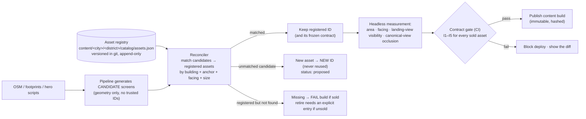

# Asset permanence: a sold location never moves, never loses importance, never changes ID

Written 2026-10-04 · Owner: engineering · Status: design (to implement before the first sale in M0).

## 1. The promise, as an engineering requirement

When someone buys `ts.1tsq.ad04` (a One Times Square billboard), we promise them **that location, forever**. The 3D world will keep improving: better meshes, materials, lighting, new districts, a new rendering engine. **None of that may change what they bought.**

The **invariants**: for every sold asset, across every future build, these must hold.

| # | Invariant | Meaning |
|---|---|---|
| I1 | **Identity** | The asset ID exists, is the same kind (screen / building / moving banner), and is never reused for anything else |
| I2 | **Place** | Same building, same face, same position: anchor within **0.5 m**, facing within **5°** |
| I3 | **Size** | Visible area ≥ **95%** of the sold area; aspect ratio unchanged (the owner's artwork must still fit) |
| I4 | **Importance** | Measured visibility ≥ what was sold: landing-view visibility ≥ sold value − 2 points, and canonical-view occlusion no worse |
| I5 | **Rendering** | The owner's approved artwork shows on that asset, day and night, at every quality tier |
| I6 | **Ownership** | The ledger says who owns it, and nothing can rewrite that history |

The world may get **better** around a sold asset; it may never get **worse for it**. Concretely:
- **Allowed:** improving the building's mesh, adding a bigger new screen nearby (it is a *new* asset), changing the sky.
- **Not allowed:** a new tower that blocks a sold screen from the landing view; moving the landing camera so a sold landing-view screen drops out of frame.

## 2. Why this needs engineering (what's true today)

The current pipeline already gives us part of this. The hero screens have **hand-authored, fixed IDs** in code (`ts.1tsq.ad04`, `ts.4tsq.crown1`, `ts.1076844.main01`), and `validate.py` rejects duplicate IDs.

But the **generated** screens (`dress_billboards.py`) are not safe:

```python
n_slot += 1
return f"ts.{key}.{kind}{n_slot:02d}"          # numbered by the order edges are visited
...
if rng.random() < 0.15: break                  # how many screens a facade gets is random
```

**Failure scenario:** OpenStreetMap adds a vertex to the outline of building 1022610 (Bertelsmann). Its edges get visited in a different order, and `up04` becomes the screen that used to be `up03`. **Owner A's billboard is now on a different part of the building, and owner B's artwork appears on A's old spot.** Nothing errors. This is exactly the bug we must make impossible.

**The fix in one sentence:** *generation produces candidates; a registry assigns identity.*

## 3. Design



### 3.1 The asset registry: the source of identity

`content/nyc/times_square/catalog/assets.json`. One entry per asset, version-controlled, reviewed in pull requests:

```json
{
  "id": "nyc.times_square.screen.ts.1tsq.ad04",
  "local_id": "ts.1tsq.ad04",
  "kind": "screen",
  "building": { "bin": "1013681", "name": "One Times Square" },
  "anchor": { "pos": [12.4, -221.0, 38.2], "normal": [0.0, 1.0, 0.0], "frame": "nyc/v1" },
  "size": { "w_m": 7.0, "h_m": 12.4, "aspect": "9x16" },
  "importance": { "tier": "landing_full", "landing_visibility": 1.00, "canonical_view": {"eye": [...], "target": [...]}, "occlusion": 0.00 },
  "status": "sold",
  "contract": { "frozen_at": "2026-10-12T14:03:00Z", "ledger_entry": "L-000123", "hash": "sha256:…" },
  "history": [{ "at": "2026-10-04", "change": "registered" }, { "at": "2026-10-12", "change": "sold" }]
}
```

Rules:
- **IDs are never generated from order or randomness.**
  - **Today's slot IDs are grandfathered as-is.** The first registry is built from the current `slot_sales.json`, and they become the `local_id`.
  - **New assets** get an ID from stable inputs: building BIN + face (the edge's compass direction) + band (height range) + an index *within that face*, assigned once and then stored. After that the registry is the authority; the formula is only used once.
- **The registry is append-only in practice:**
  - entries are never deleted;
  - **retiring an unsold asset** needs an explicit `"status": "retired"` entry with a reason, plus code-owner review;
  - **sold assets cannot be retired** at all.
- **Freezing the contract.** At the moment of sale, the entry's `anchor`, `size` and `importance` are **frozen**: copied into the ledger entry, with a hash. The sold contract is that snapshot, not whatever the file says later.

### 3.2 The reconciler: matching new geometry to registered identity

It runs after every build. For each registered asset, it finds the best candidate:
- the same building (BIN);
- the same kind;
- facing within 5°;
- anchor within 0.5 m (sold) or 2 m (unsold);
- size within 10%.

The scoring picks the minimum combined distance, using Hungarian matching per building, so two screens can't swap.

| Result | Action |
|---|---|
| Matched | The candidate takes the registered ID. The mesh can be completely new (an improved model). |
| Registered, no match, **sold** | **Build fails.** The engineer must fix the geometry so the asset exists where it was sold. |
| Registered, no match, unsold | Build fails unless the registry has a reviewed `retired` entry |
| Candidate, no match | New asset, new ID, `status: proposed`. Not for sale until a human sets `available`. |

Generation can also be told: **"these registered assets must exist; build around them"**. Sold assets are fed back into `dress_billboards.py` as fixed placements, so randomness can never remove them.

### 3.3 Measuring importance (headless, deterministic)

A headless Chrome job (Playwright) loads the build at the exact landing camera and at each asset's canonical view. It measures, per asset:
- **landing visibility**: the share of 9 sample points in view and unoccluded. This is the method used for the pricing doc.
- **occlusion from the canonical view**;
- **projected area**.

Results go to `build_report.json`. **Gate I4** compares them with the frozen contract.

Rules that keep this honest:
- The landing camera and canonical views are part of the city package (`city.json`) and versioned.
- **The landing camera may only change if every sold landing-view asset still passes I4** in the new view. The gate enforces it.
- Content additions (new towers, new props) are measured the same way. If they occlude a sold asset, the build fails.

### 3.4 Rendering contract (I5)

- The client finds the surface for an asset by **ID, not object name**. Each slot surface carries `slot_id` (it already does: `MAT_SLOT_<slot_id>`, `userData.slot_id`). The ID map ships in the content manifest.
- Approved artwork is served from `/art/<asset_id>/<version>.webp`, immutable.
- The client test suite renders every sold asset with a test pattern at every quality tier, day and night (a Playwright screenshot diff), and fails if any is blank, stretched or missing.

### 3.5 Ownership integrity (I6): the ledger

**Postgres is protected at the role level:**
- The app role has `INSERT` and `SELECT` on `ledger`. `UPDATE`, `DELETE` and `TRUNCATE` are revoked.
- A trigger rejects any change to an existing row, even by the table owner during normal operation.

**The ledger is hash-chained:**
```
entry_hash = sha256(prev_hash || canonical_json(entry))
```
Rewriting any past entry breaks every later hash. A nightly job verifies the whole chain.

**`ownerships` is a projection:**
- It's rebuilt from the ledger.
- `UNIQUE(asset_id)` means one owner per asset, ever.
- The purchase transaction writes the ledger entry and the ownership row together.

**Off-site immutable copy:**
- Every night the ledger is exported to object storage with a retention lock: GCS Bucket Lock, which maps to S3 Object Lock or Azure immutable blob storage.
- Even an admin with database access can't silently rewrite history: the locked copy and the chain would disagree.

**Reconciliation:**
- A daily job compares Stripe's paid payments with ledger `order_paid` entries, both ways.
- Any mismatch pages a human.

**Owner-verifiable:**
- The certificate page `/own/<asset_id>` shows the owner, the date, the ledger entry ID, its hash, and the frozen contract (place, size, importance).
- Anyone can check it against the published daily chain head.

## 4. The CI contract gate (what runs on every content build)

1. `pipeline/catalog/reconcile.py`: candidates → registry. It fails on rules 3.2.
2. `pipeline/qa/contract_gate.py`, for every `status ∈ {sold, reserved}`:
   - I1: the ID exists, same kind, not reused.
   - I2: anchor Δ ≤ 0.5 m, facing Δ ≤ 5°, same BIN.
   - I3: area ≥ 95% of frozen, same aspect.
   - I4: landing visibility ≥ frozen − 0.02; canonical occlusion ≤ frozen + 0.02.
3. `apps/web` Playwright: the I5 render check for sold assets (test pattern, all tiers, day and night).
4. `CODEOWNERS`: any diff to `catalog/assets.json` or `city.json` landing views needs a second approval.
5. The deploy job refuses to publish a content build without a passing `build_report.json` signed by CI.

## 5. What this lets us do safely

- **Completely rebuild Times Square in higher quality** (a new engine, WebGPU, better meshes). The gate proves every owner kept their place, size and importance.
- **Add screens, buildings and districts.** They're new IDs and new inventory, and can never collide with sold ones.
- **Switch clouds** (`architecture.md` §3). The registry lives in git and the ledger moves with Postgres, its locked exports and its hash chain.

## 6. Work items (in M0 order)

1. **Generate the first registry** from today's `slot_sales.json` and `properties.json`: grandfather all 112 IDs and 137 buildings; record anchors, sizes and the measured landing visibility.
2. **Freeze `dress_billboards.py` output for the existing IDs:**
   - seed every random choice per building;
   - feed registered assets back as fixed placements.
3. **Reconciler + contract gate** in CI (Python, about a day of work).
4. **Ledger:** the role grants, the immutability trigger, the hash chain, the nightly locked export, and Stripe reconciliation.
5. **Certificate page** `/own/<asset_id>`: ledger entry, hash, frozen contract.
6. **Playwright** I4/I5 measurement (headless landing-view visibility + render check).
