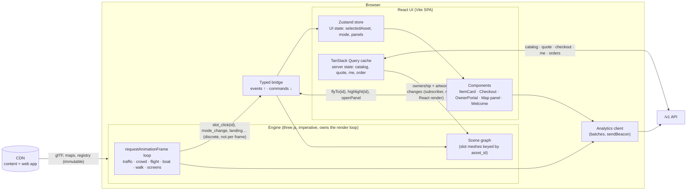
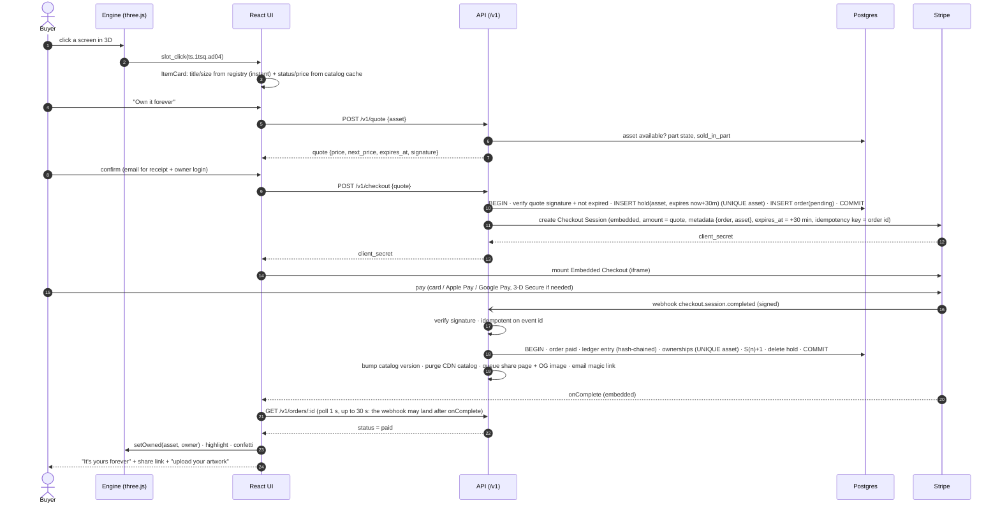

# Data flow: how data reaches the 3D world and React, how payment works, and how we avoid lag

Written 2026-10-04 · Companion to `architecture.md` (§12 stack, §6 commerce) and `asset_permanence.md`.

## 1. Four kinds of data, four different paths

| Kind | Examples | Size | Changes | Path | Who uses it |
|---|---|---|---|---|---|
| **A. World content** | glTF chunks, textures, maps, nav, collision, asset registry (positions, sizes, titles) | 20–60 MB | Only on a content release | CDN, content-hashed files, cached for 1 year (`immutable`) | **Engine only.** React never holds it. |
| **B. Live commerce** | Per asset: status (available / held / sold), owner display name, current price, next price, "N left in part", last sold | ~250 assets ≈ **40 KB JSON, ~8 KB gzipped** | On every sale (a few times a day at launch) | `GET /v1/catalog?city=nyc`, cached at the CDN for 10 s + stale-while-revalidate, **purged on every sale**; ETag for cheap re-checks | React (item card, panels) **and** engine (the "Owned by" labels, the owner's artwork) |
| **C. The user's own** | Owner session, my assets, my artwork status, order status | Tiny | On user action | `GET /v1/me`, `GET /v1/orders/:id`. HttpOnly session cookie; **never cached** at the CDN | React |
| **D. Analytics out** | Events (`slot_view`, `buy_sheet_open`, …) | ~1–3 KB per batch | Continuous | `POST /v1/events` every 10 s + `sendBeacon` on page hide | Nobody in the UI; it goes to the lake |

**Rule:** big things are static and immutable (A); live things are small and cheap to refresh (B, C). This is why the web app can be static files with no server rendering. Everything live is a small JSON call to the API.

**The API is on the same origin**, behind the load balancer at `/v1/*`. That means no CORS, and cookies stay first-party with `SameSite=Lax`.

## 2. Client architecture: the engine and React side by side

How the two halves talk:
1. **The engine never waits for React, and React never runs per frame.**
   - The engine emits **discrete** events only: `slot_click`, `slot_hover_start/end`, `mode_change`, `tour_gate`, `landed`.
   - HUD numbers that change every frame (speed, altitude) are written by the engine straight to their DOM node, or to the store at most 10 times a second.
2. **React drives the engine with commands** (`engine.flyTo(assetId)`, `engine.highlight(assetId)`, `engine.setArtwork(assetId, url)`). They're plain function calls with no re-render coupling.
3. **Server state lives in TanStack Query.** It handles caching, request de-duplication, retries, refetch on window focus, and stale times:

   | Query | Stale time |
   |---|---|
   | `catalog` | 15 s |
   | `quote` | never cached |
   | `me` | 0 s |

   **The engine subscribes to the catalog query outside React** (`queryClient.getQueryCache().subscribe`). When an asset becomes sold, it updates that one mesh's label and artwork, and nothing else re-renders.
4. **UI state lives in Zustand:** the selected asset, the open panel, the mode. Components subscribe to slices with selectors, so opening the item card re-renders only the card.
5. **The registry ships with the content (A).** That's titles, sizes, positions and the canonical view per asset. The item card shows title, size and location **instantly** from the registry, and fills in price and status from the catalog (B), which is usually already cached.

### 2.1 How fresh the "live" data is (no websockets at launch)

| Moment | Freshness mechanism |
|---|---|
| Page load | `GET /v1/catalog` (from the CDN, ≤ 10 s old) |
| While playing | Refetch every 60 s using the ETag (unchanged → `304`, about 200 bytes), and on window focus |
| Item card opened | Immediate refetch of that asset's status (a cheap per-asset call) |
| Buy pressed | **Server-computed quote.** This is the only price that matters (§3) |
| Someone else buys while you look | The next refetch marks it sold within ≤ 60 s. If you press Buy first, the quote call says "just sold", with no money taken |

Why not websockets or server-sent events now:
- About 250 assets and a few sales a day don't need push.
- Polling with ETags is nearly free and works on every cloud without stateful connections.
- **Revisit** if sales reach several per minute (an auction or New Year's Eve). Then add server-sent events for `asset_sold` / `auction_bid` (Cloud Run supports long-lived HTTP streaming).

## 3. Payment, end to end

**Choice: Stripe Checkout in embedded mode**, mounted in a React modal over the 3D world.

| Option | Verdict |
|---|---|
| Hosted Checkout (redirect to stripe.com) | Simplest, but it **leaves the 3D world**. Coming back reloads the app: the content is cached, but it still re-initialises and breaks the moment. |
| **Embedded Checkout (iframe in our page)** | **Chosen.** No redirect, and the world keeps running behind the modal. Card data never touches our code (Stripe hosts the form, so our PCI scope stays minimal: self-assessment questionnaire A). Apple Pay, Google Pay and Link work. 3-D Secure is handled. |
| Custom Payment Element | More UI control, more code, and more edge cases. Not needed. |

### 3.1 Every way it can fail, and what happens

| Situation | Handling |
|---|---|
| Two people press Buy on the same asset | `UNIQUE(asset)` on `holds`. The second gets "someone is checking out this screen, try again in a few minutes", or is offered the waitlist. **No money is taken.** |
| A buyer abandons checkout | The Stripe session expires after 30 min (the minimum Stripe allows), and the `checkout.session.expired` webhook deletes the hold. A sweeper job also deletes expired holds. |
| The price rises while someone is in checkout | Their quote is honoured: the price is fixed in the session. The next buyer sees the new price. |
| The webhook arrives twice, or late | Idempotent on the Stripe event ID. The order-status poll keeps waiting up to 30 s, then shows "payment received, confirming…" and emails on completion. |
| The webhook never arrives (an outage) | The reconciliation job (asset_permanence §3.5) finds paid sessions without ledger entries and completes them. |
| Paid, but the asset was somehow taken | It can't happen with holds + unique ownership. If it ever does, there's an automatic full refund + an apology email, and an alert pages us. |
| Card declined / 3-D Secure failed | Handled inside the Stripe iframe. Nothing is written on our side; the hold stays until it expires or a retry succeeds. |
| Fraud | Stripe Radar is on. Cards and wallets only (no delayed bank payments, so ownership is granted instantly and safely). |
| Refund (before artwork goes live) | Admin action → Stripe refund → ledger `refund` entry → the asset returns to `available` at **the current price** (prices never go down). |

**Decisions to confirm with the owner/accountant:**
- **Sales tax / VAT on digital goods.** Stripe Tax can calculate and collect it, which matters especially for EU and UK buyers.
- **Currency:** USD at launch.
- **Receipt / invoice wording:** "permanent virtual placement", with the terms linked.

## 4. Interactivity and lag: what actually matters

**Lag has three sources.** None of them is the choice between React and Next.js.

| Source | Symptom | Fix |
|---|---|---|
| **GPU / render loop** | Low frame rate, stutter when turning | Draw-call and triangle budgets, LOD, instancing, KTX2 textures, adaptive quality (architecture §13) |
| **Main-thread long tasks** | Clicks feel delayed (poor INP): a button press waits for a frame or a parse | Parse glTF and decode textures **in Web Workers**; stream chunks over several frames; never block more than ~8 ms of a 16 ms frame; React panels open with `startTransition`; split checkout and owner portal so they load only when opened |
| **React re-renders** | The UI hitches while flying or driving | No per-frame state in React; Zustand selectors; HUD written directly to the DOM; the engine never imported into components |

Targets:
- **Interaction to Next Paint (INP) < 200 ms** on a mid-range phone.
- **No frame over 33 ms** when opening a panel.
- Measured with the `perf` analytics events and a Playwright trace in CI.

### 4.1 Would Next.js lag more or less? (facts)

| Question | Answer |
|---|---|
| In-game frame rate | **Same.** The render loop is browser three.js either way. |
| Time until the 3D world starts | **Slightly later with Next.js** (+69 KB measured, and the page **hydrates** before our client code runs). Server-rendered HTML doesn't help a canvas game: there's nothing to show until the engine runs. |
| Click responsiveness once loaded | **Same.** It's React in both, and the same rules from §4 apply. |
| Navigating between pages | Both do client-side routing: same. |
| First request after idle | Next.js server rendering on a scaled-to-zero container can **cold start** (often around a second) unless you pay for an always-on instance. Static files never cold start. |
| Share-preview / SEO pages | Next.js has it built in. We **pre-render at sale time** instead (`/own/<asset_id>` static HTML + preview image). |

**Conclusion:** on interactivity, Next.js would be **equal or slightly worse**, never better, for this app. It would be better only for a large content or SEO site, which we'd build separately if we ever need one.

## 5. Typed contracts (so the data can't drift)

- `packages/schemas` holds **Zod** schemas for every API response (`Catalog`, `Quote`, `Order`, `Me`) and every analytics event.
- The API validates its outputs against them. Hono + `zod-openapi` publish an **OpenAPI** spec, and the React client uses the types, so the price field can't be renamed silently.
- The registry (A) and the catalog (B) join on **`asset_id`**, the permanent ID from `asset_permanence.md`.

## 6. Caching summary

| What | Where | Cache rule |
|---|---|---|
| `index.html`, `world.json`, manifests | CDN + browser | `no-cache` (revalidate every load) |
| Hashed JS/CSS, glTF, textures, maps, registry | CDN + browser | `max-age=31536000, immutable` |
| Owner artwork `/art/<id>/<version>.webp` | CDN + browser | immutable (a new version means a new URL) |
| `/v1/catalog` | CDN | `s-maxage=10, stale-while-revalidate=60`, **purged on sale**, ETag |
| `/v1/quote`, `/v1/checkout`, `/v1/me`, `/v1/orders/*` | — | `no-store` |
| Share pages `/own/<id>` | CDN | `max-age=300` (regenerated on sale or artwork change) |

## 7. Security in the data flow

- **Prices only from the server.** The client sends the asset ID and the signed quote, never an amount.
- **Content Security Policy** allows Stripe only where needed:
  - `script-src 'self' https://js.stripe.com`;
  - `frame-src https://js.stripe.com https://checkout.stripe.com`;
  - `connect-src 'self' https://api.stripe.com`.
- **The webhook endpoint:** Stripe signature check; rejects anything older than 5 minutes; rate-limited; never cached.
- **Owner session:** HttpOnly + Secure + `SameSite=Lax` cookie; CSRF token on state-changing owner calls; magic-link tokens are single-use with a 15-minute expiry.
- **No personal data in analytics events.** The email lives only on the order and owner rows.
